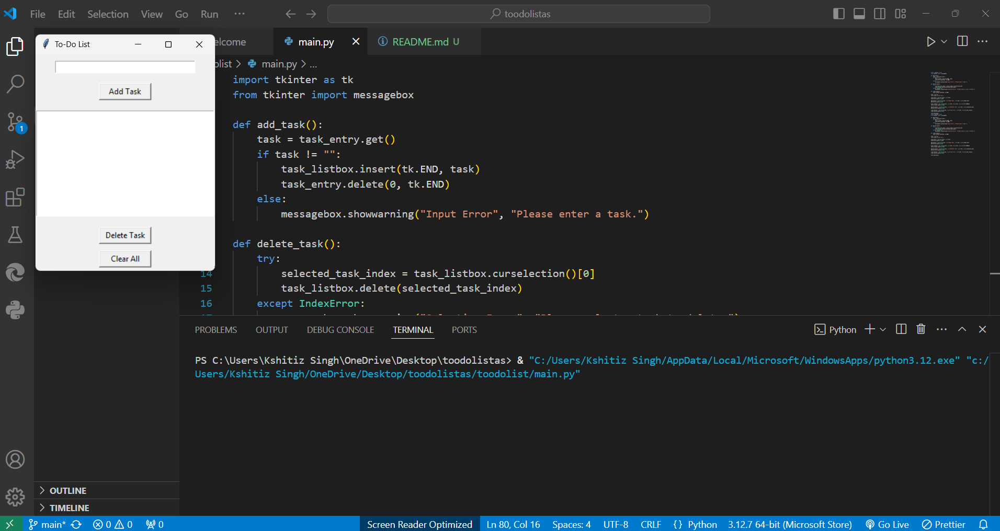
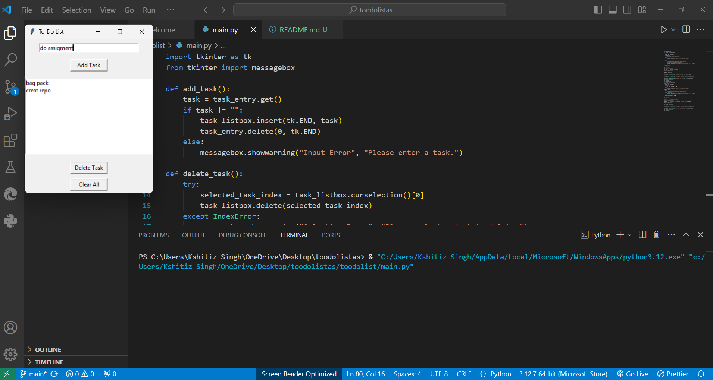

# To-Do List Application

This is a simple **To-Do List** application built using Python's `tkinter` library. It allows users to manage tasks by adding, deleting, and clearing them from a list.

---

## Features

- **Add Tasks**: Add a new task to the to-do list.
- **Delete Tasks**: Remove a selected task from the list.
- **Clear All Tasks**: Clear all tasks from the list at once.
- User-friendly interface with error handling for invalid inputs or actions.

---

## Requirements

- Python 3.x
- `tkinter` (comes pre-installed with Python)

---

## How to Use

1. Save the script as a `.py` file (e.g., `todo_list.py`).
2. Run the script:
   ```bash
   python todo_list.py



---